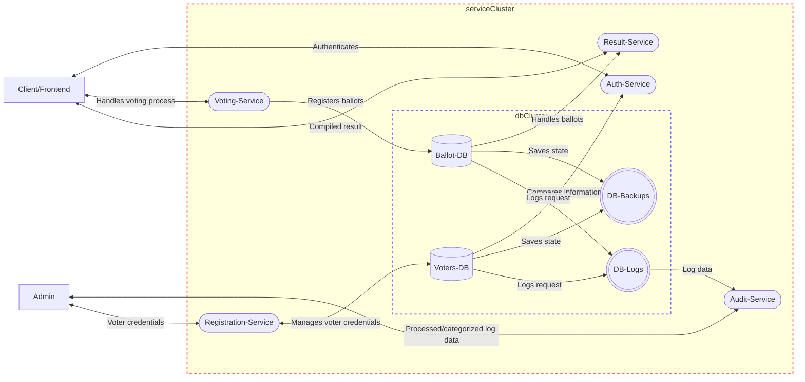

# Data Flow Diagram

<!--
flowchart LR, TB, RL, BT to change the flow direction.
-->

[Mermaid Flowchart](https://mermaid.js.org/syntax/flowchart.html)

```mermaid
flowchart LR
      style serviceCluster stroke:#f66,stroke-width:2px,stroke-dasharray: 5 5;
      style dbCluster stroke:#66f,stroke-width:2px,stroke-dasharray: 5 5;

      client[Client/Frontend]
      client <-- Authenticates --> authService
      client <-- Handles voting process --> voteService
      resService <-- Compiled result --> client

      admin[Admin]
      admin <-- Processed/categorized log data --> auditService
      admin <-- Voter credentials --> registrationService

      subgraph serviceCluster
            auditService([Audit-Service])
            dbLogs -- Log data --> auditService

            authService([Auth-Service])
            votersDb -- Compares information --> authService

            voteService([Voting-Service])
            voteService -- Registers ballots --> ballotDb

            resService([Result-Service])
            ballotDb -- Handles ballots --> resService

            registrationService([Registration-Service])
            registrationService <-- Manages voter credentials --> votersDb

            subgraph dbCluster
                  ballotDb[(Ballot-DB)]
                  ballotDb -- Saves state --> dbBackups
                  ballotDb -- Logs request --> dbLogs

                  votersDb[(Voters-DB)]
                  votersDb -- Saves state --> dbBackups
                  votersDb -- Logs request --> dbLogs

                  dbBackups(((DB-Backups)))
                  dbLogs(((DB-Logs)))
            end
      end
```
