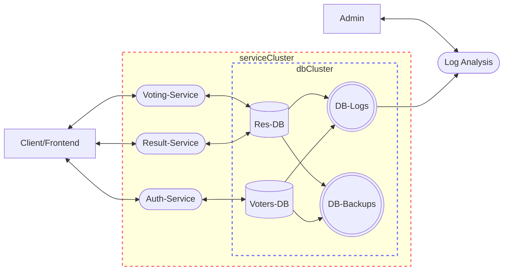

# Data Flow Diagram

<!--
flowchart LR, TB, RL, BT to change the flow direction.
-->

[Mermaid Flowchart](https://mermaid.js.org/syntax/flowchart.html)

The data holds information such as valid voters, votes cast etc. The databases should perhaps be seperated for security reasons.

