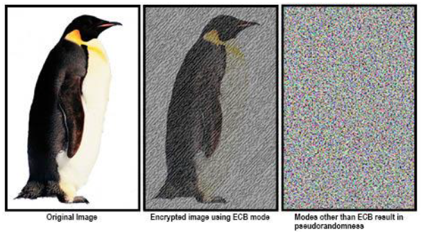
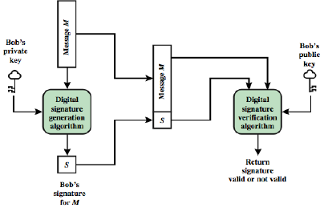

# Data Security

## Introduction

Security involves safeguarding against harm or loss, ensuring confidentiality, integrity, and availability of assets. In information security, it protects data and systems from unauthorized access, alteration, or destruction. Balancing security with personal privacy sparks varied public opinions. Scientifically studied in cryptography, cyber-security, and risk management. The security process involves identification, protection, detection, response, and recovery.

### Abbreviations

| Abbreviation | Meaning                                      |
| ------------ | -------------------------------------------- |
| `CIA`        | Confidentiality, Integrity, Availability     |
| `P` or `PT`  | Plaintext                                    |
| `C` or `CT`  | Ciphertext                                   |
| `K`          | Key                                          |
| `Cipher`     | Algorithm used for encryption and decryption |

## Security Process Steps

Identify > Protect > Detect > Respond > Recover

## Cryptology

Encryption converts plaintext to ciphertext using a key. Cryptography studies encryption and decryption, while cryptanalysis explores breaking encryption, justified if the cost is less than the value of information obtained. Cryptology encompasses both.

### Types of Ciphers

#### Block Cipher

Block ciphers encrypt fixed-size blocks (e.g., DES with 64-bit blocks). The Feistel Cipher is foundational to block ciphers. Different modes of operation, like _Electronic Codebook_ (ECB), _Cipher Block Chaining_ (CBC), and _Cipher Feedback_ (CFB), handle arbitrary-length messages.

#### Substitution Cipher

Replaces letters based on a predetermined rule, utilizing a substitution box (S-box).

#### Transposition Cipher

Alters letter order, employing a permutation box (P-box).

#### Summary

A hybrid approach is most secure, combining substitution and transposition ciphers as only applying one is not secure enough.

### Commonly Used Encryption Standards

#### DES (Data Encryption Standard)

Uses 56-bit keys, susceptible to MIM attacks. Transitioned to AES for enhanced security.

#### AES (Advanced Encryption System)

Employs 128-bit, 192-bit, or 256-bit keys with varying rounds.

#### RSA (Rivest-Shamir-Adleman)

Uses interchangeable public and private keys for asymmetric encryption. Susceptible to MitM attacks, addressed by key exchange protocols.

#### Summary

An encryption method should have a number of properties to ensure it is secure. Examples of these are:

- [Avalanche effect](https://en.wikipedia.org/wiki/Avalanche_effect)
- [Completeness](<https://en.wikipedia.org/wiki/Completeness_(cryptography)>)

### Integrity Options

#### Parity

Simple error detection by adding a bit, detecting single bit flips.

#### Hashing

Generates a unique value for input, enhancing security, widely used in password storage.

#### Digital Signatures

Verify message authenticity and integrity, ensuring computationally secure signatures.

### Program Security

Security tests identify vulnerabilities in programs, necessitating collaboration between developers, testers, and users. Complex programs are prone to faults; simplicity is crucial for security. Regular updates are essential to address evolving technologies.

#### Buffer Overflow

Enables unauthorized code execution or system crashes by overflowing memory with excessive data.

#### Incomplete Mediation

Fails to verify user permissions, potentially granting unauthorized access.

#### Time of Check to Time of Use

Involves changes to a resource between access check and use, akin to receiving a forged item after purchase.
