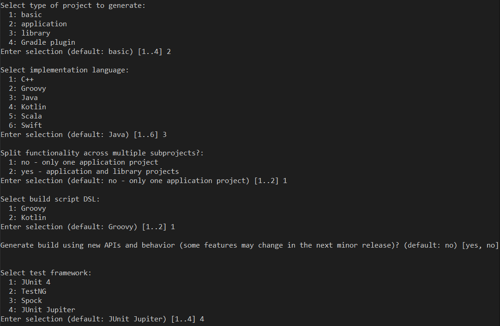

# Java

## Installations
* [JRE](https://www.oracle.com/java/technologies/downloads/) Java Runtime Enviroment (Used to run java applications).
* [JDK](https://www.oracle.com/java/technologies/downloads/) Java Development Kit (Used when developing java applications).
* [Gradle](https://gradle.org/install/) Build tool.
* [Coding Pack for Java](https://code.visualstudio.com/docs/java/java-tutorial) All in one pack.

## Initialise



Run the command below now instead of `gradle run` to remove extras.
```java
gradle run -q --console=plain
```